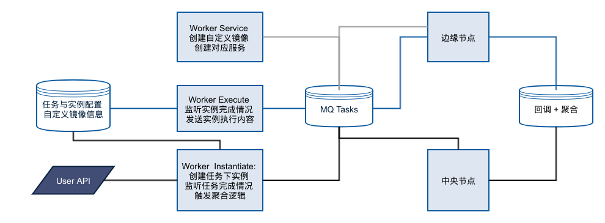
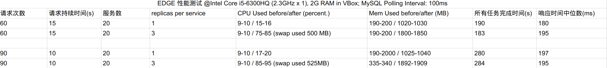

## 边缘节点通用任务模板
#### 吴凯
#### 导师: 甘建勋
#### 2017.08.28

### 缘起
- 需要一个工具查看边缘节点的网络情况(like [17ce](www.17ce.com))
- 需要一个基础性的容器模板, 用户可以基于此制作属于自己的任务, 方便水平扩展

### 生产环境约束
- 边缘节点的端口限制较严, 直接使用 Remote API 需对额外端口备案
  - 使用 SSH Login 创建服务
- 边缘节点资源限制 + 负载变化: 合理使用节点资源 -> 服务伸缩:
  - 服务创建时的资源限制
  - 服务运行时的副本数调整

- 多线机房, 需要将 service 创建后使用的网络和实际运行线路关联:
  - Bridge? Overlay?
  - 容器 IP 如何与多网卡线路绑定?

### 需求分析与技术选型
- 备选方案
  1. 启动容器时指定 host 网络, 让容器具有跟宿主机一样的网络环境
    - 直接和宿主机共享同一个 Network Namespace
    - 缺点: 对主机网络有完全访问权, 危险!
  2. 创建 scope 为 swarm 的 bridge 网络
    - scope=swarm: 广播 swarm manager 节点间网络配置
    - 依然是 bridge network, 相对安全
    - iptables: NAT 链
    - 策略路由

- 最终选择: Bridge Network(scope=swarm) + 策略路由
  - TODO: 简单的配置代码

### 其他
- 线上部署: Docker Compose
- 其他: WebApp: flask; UI: vue.js
- 前后端完全分离, 可分开部署
Note: 文档规定新开发项目开发与部署需要 Docker 化

### 项目简单结构

<!-- .element height="100%" width="100%" -->

### 开发流程
- Past: 完全基于轮询 DB 创建任务及其实例.
  - 缺点: 每个实例对应一个 swarm service, 大量的dead container -> 资源浪费
  - 需要对 service 及其容器定期 gc
  - 流程速度过慢, 一次实例对应一次 SSH Login, 实无必要

- Now: 基于 MQ 进行 SSH 服务创建与实例执行
  - 一个服务对应一个 queue
  - 服务一次性创建, 启动后只监听 queue, 服务数与任务无关
  - 灵活添加新服务或更改原服务
  - 多任务并发
  - speed boosted!

### DEMO

### 性能测试
 <!-- .element height="3000%" width="3000%" -->

### 展望
- 服务的自动伸缩:
  - 配合外部监控数据与本地参数监测
- 服务创建的自动化流程打通:
  - 自动创建代码与 Docker 仓库, 更加方便用户扩展
- 监听未完成任务的流程优化

### Q & A
