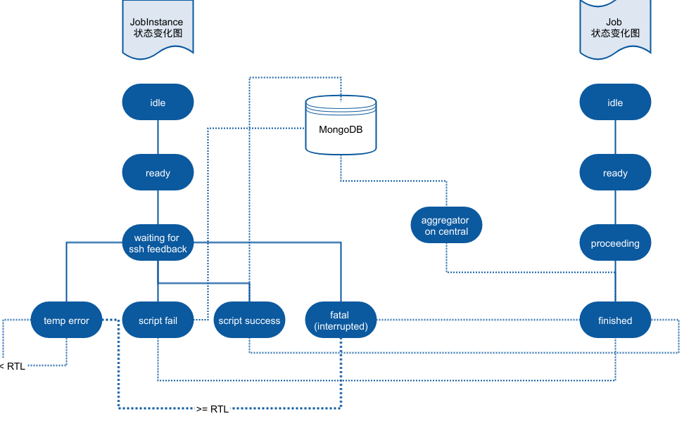

## 实习阶段报告
### 吴凯
### 2017.08.28

- 前端 demo 命令页面基本完成.
- 创建了新建 Image 的API, Image 入库后默认在所有边缘或者中央节点创建 service, 因为 service 中容器启动后只负责开启 celery 消费端监听 MQ.

- service 的初始化创建和 image 新建流程初步做到了服务化, 通过 rabbitmq 异步执行 ssh 连接创建 service, 和 job instance 的具体执行, 提高了流程的总体执行速度.

<!-- .element height="100%" width="100%" -->

- 开始使用 locustio 对项目的 API 接口进行性能测试.
Note: Only for speaker
